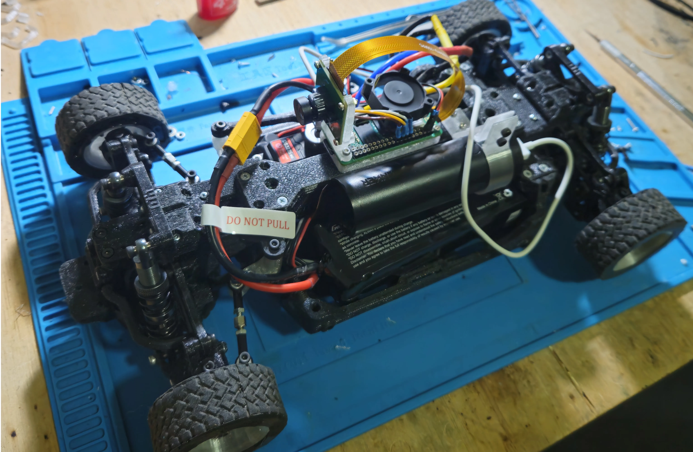

<p align="center">
    
    <h1 align="center">rc</h1>
</p>

<p align="center">
    **rc** is just a simple implementation of a Xbox Controller -> ESC + Servo control through UDP, using a Radxa Zero 3W (similar to Raspberry Pi Zero)
</p>
---

## Developing

Install mise

```sh
curl https://mise.run | sh
```

### Client

This service runs where the controller is connected to, via USB-C or Bluetooth

It read the Gamepad state through XInput API and send the data over UDP to the Server

PS: The client was made and tested only in Windows 11


```sh
mise client # starts the client
```

### Server

This runs in the Radxa, and it read the input from the *client*

```sh
mise server
```
